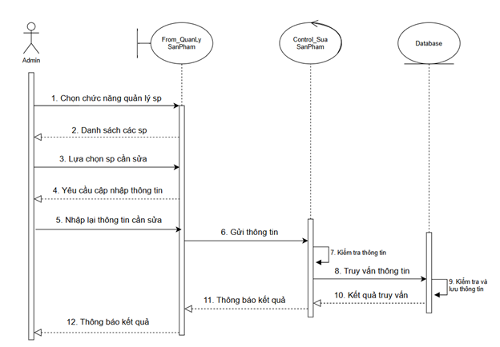

# shop_onl

shop_onl is a website that sells office attire for women

link demo: https://www.youtube.com/watch?v=9Ykmn7iKAEE
# Chức năng

❖ Thứ nhất: Phần người dùng 

• Thứ hai: Phần quản trị viên: 
 Người dùng là những người có nhu cầu mua sắm đồ công sở, họ sẽ tìm kiếm các 
mặt hàng phù hợp với nhu cầu của mình trên hệ thống và đặt mua các mặt hàng 
này. Vì thế phần người dùng có các chức năng sau: 

o Đăng kí và đăng nhập. 

o Hiển thị danh sách mặt hàng của cửa hàng để khách hàng xem, lựa chọn và 
mua. 

o Người dùng xem các thông tin, khuyến mãi và đánh giá của khách hàng trước 
về cửa hàng. 

❖ Thứ hai: Phần quản trị viên: 

• Người quản trị có quyền kiểm soát mọi hoạt động của hệ thống. Người này được 
cấp username và password để đăng nhập hệ thống thực hiện chức năng của mình. 
Vì thế phần quản trị viên có các chức năng sau. 

o Chức năng cập nhật, sửa, xoá các mặt hàng, loại hàng, tài khoản khách hàng, 
slider, ngôn ngữ, mã giảm giá và xem thống kê doanh thu. 

o Tiếp nhận kiểm tra đơn hàng của khách hàng, hiện thị đơn đặt hàng, hỗ trợ 
khách hàng.

# Công nghệ sử dụng

Frontend: HTML, CSS, JavaScript, Bootstrap

Backend: PHP, MySQL

Frameworks/Libraries: Bootstrap, jQuery

Công cụ hỗ trợ: XAMPP, phpMyAdmin

# Cách cài đặt và chạy dự án

Yêu cầu: XAMPP hoặc môi trường PHP + MySQL

<<<<<<< HEAD
# Sơ đồ user case tổng quát

# Biểu đồ tuần tự
# Biểu đồ đăng kí

# Biều đồ đăng nhập

# Tìm kiếm sp

# Đặt mua

# Thanh toán

# Thêm sp

# Sửa sp

# Xoá sp

# Một số hình hình ảnh của trang web

## Trang chủ

## giỏ hàng

## thanh toán

# Giao diện của người quản trị

## trang tổng quát

## Thêm sản phẩm

## Thêm chi tiết sản phẩm

## Danh sách đơn đặt hàng

## Danhh sách người dùng

=======
>>>>>>> 9c12c7058a2e8075977e8028ce4efd7321431e7e
